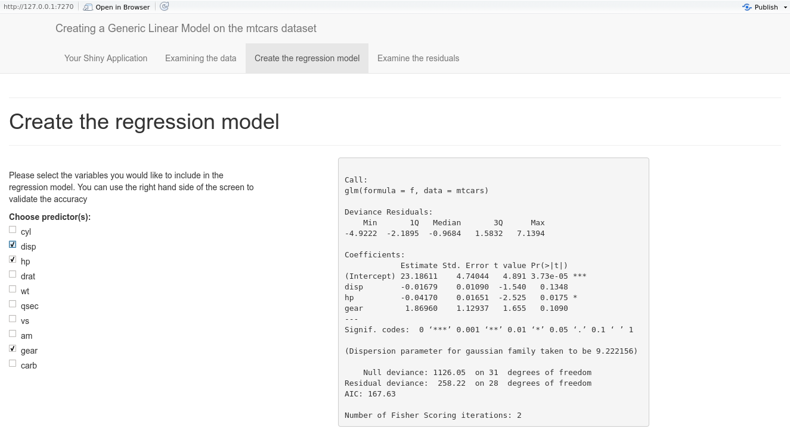
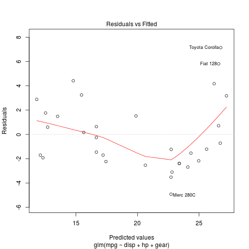

Developing Data Products Pitch
========================================================
author: Alex Hannon
date: 20/11/2015

Creating a General Linear Model application
========================================================

The concept of my coursework was to create a simple regression model that a user could control, allowing them to select applicable variables. Thus my application provides three pieces of functionality

- Provides an overview of the dataset
- Provides the means of selecting which variables you will input into the model, whilst providing the necessary statistical information to do so.
- Allows the user to review the residual graphs for further analysis

Creating the model
========================================================
As can be seen here, all variables except the one we wish to predict, MPG, are available to select for the model creation. 

Slide With Plot
========================================================

Furthermore any potential researchers are assisted through the use of six additional plots which investigate the relationship between the predicted and actual values

 

Thank you for watching my slidify presentation
========================================================
Wishing you all the best.
